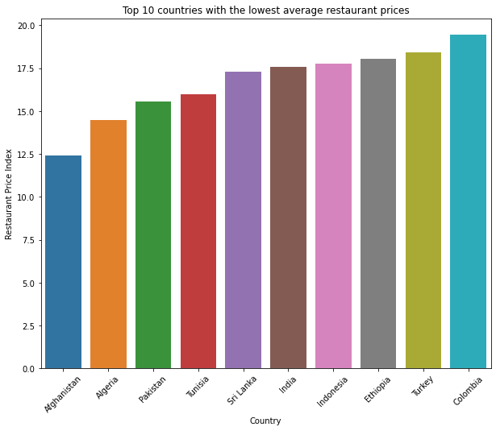
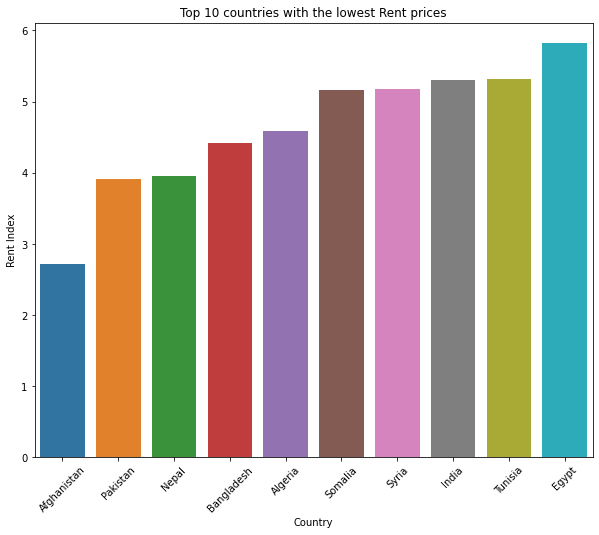

# Cost of Living Index 2022 Analysis and Visualizations

Cost of Living Index (Excl. Rent) is a relative indicator of consumer goods prices, including groceries, restaurants, transportation and utilities. Cost of Living Index does not include accommodation expenses such as rent or mortgage. If a city has a Cost of Living Index of 120, it means Numbeo has estimated it is 20% more expensive than New York (excluding rent).


# Table of contents

<a href="#1">1. Exploring the Data </a>  

<a href="#2">2. Data Visualizations </a> 

<a href="#3">3. Türkiye vs Azerbaijan</a>  

<a href="#4">4. Some Relations Between Indexes </a> 


<a id="1"></a>

## 1. Exploring the Data
- introduce to basic setup of folder, install `pandas`, `matplotlib`, `seaborn` (using `pip` for Python package), `Anaconda` is a good choice if you are using Windows (or even Mac, Linux). Alternatively, try out [**Google Colaboratory**](https://colab.research.google.com/)
- basic use of those tools (clean, explore, plot, interpret)
- The dataset used in the project [Dataset](https://www.kaggle.com/datasets/ankanhore545/cost-of-living-index-2022/)
  
- here are some steps to get the data into proper format
 
```python

df = pd.read_csv("Cost_of_Living_Index_2022.csv")


top_10_restaurant = df.sort_values(by = ['Restaurant Price Index'],ascending=False).head(10)
lowest_10_restaurant = df.sort_values(by = ['Restaurant Price Index'],ascending=True).head(10)

top_10_groceries = df.sort_values(by = ['Groceries Index'],ascending=False).head(10)
lowest_10_groceries = df.sort_values(by = ['Groceries Index'],ascending=True).head(10)

top_10_rent = df.sort_values(by = ['Rent Index'],ascending=False).head(10)
lowest_10_rent = df.sort_values(by = ['Rent Index'],ascending=True).head(10)

top_10_costofliving = df.sort_values(by = ['Cost of Living Index'],ascending=False).head(10)
lowest_10_costofliving = df.sort_values(by = ['Cost of Living Index'],ascending=True).head(10)

top_10_power = df.sort_values(by = ['Local Purchasing Power Index'],ascending=False).head(10)
lowest_10_power = df.sort_values(by = ['Local Purchasing Power Index'],ascending=True).head(10)


```

 <a id="2"></a>
## 2. Data Visualizations

- here are some graphs produced from this exercise
  
  - Top 10 countries with the highest average restaurant prices
  <p align="center">
    
  </p>
  
  - 10 countries with the Lowest average restaurant prices
  <p align="center">
    
  </p>

 - Top 10 countries with the highest average Groceries prices
  <p align="center">
    
  </p>
  
  - 10 countries with the lowest average Groceries prices
  <p align="center">
    
  </p>
  
  - Top 10 Countries with the Highest Rent Prices
  <p align="center">
    
  </p>
  
  - 10 Countries with the Lowest Rent Prices
  <p align="center">
    
  </p>

  - Top 10 Countries with the Highest Cost of Living
  <p align="center">
    
  </p>
  
  - 10 Countries with the Lowest Cost of Living
  <p align="center">
    
  </p>

  - Top 10 Countries with the Highest Local Purchasing Power
  <p align="center">
    
  </p>
  
  - 10 Countries with the Lowest Local Purchasing Power
  <p align="center">
    
  </p>


<a id="3"></a>
## 3. Türkiye vs Azerbaijan

- Türkiye vs Azerbaijan
  <p align="center">
    
  </p>


<a id="4"></a>
## 4. Some Relations Between Indexes

- Restaurant Price Index - Groceries Index
  <p align="center">
    
  </p>
  
  - Local Purchasing Power Index - Cost of Living Index
  <p align="center">
    
  </p>

  - Rent Index - Cost of Living Index
  <p align="center">
    
  </p>

